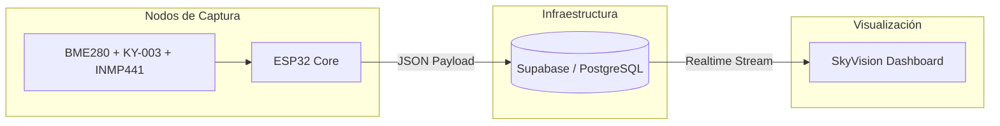

# 🛰️ SkyVision Pro (Sonda Meteorológica IoT)


**SkyVision Pro** es un ecosistema de monitoreo ambiental avanzado diseñado para ofrecer precisión métrica y una experiencia de usuario excepcional. Integra hardware de bajo consumo con una plataforma de datos en la nube de alta disponibilidad.

---

## 🎨 Experiencia Visual
El dashboard implementa el sistema de diseño **Celestial Breeze**, enfocado en la claridad, el minimalismo y el uso de *Frosted Glass* (Glassmorphism) para ofrecer una estética de grado profesional.

## 🏗️ Arquitectura de Datos
El sistema utiliza una arquitectura reactiva donde el flujo de información es bidireccional y en tiempo real:



## ⚡ Características Destacadas
- **Backfill Inteligente:** Capacidad de recuperar datos históricos mediante integración con APIs climáticas globales para cubrir vacíos de telemetría.
- **Analíticas Dinámicas:** Visualización multiescala (1H, 24H, 7D, 30D) con optimización de renderizado de puntos críticos.
- **Pila Tecnológica Moderna:** React 18, Vite, Lucide/Material Symbols y Framer Motion.

## 📂 Organización del Proyecto
- `Aplicación/`: Frontend en React. Implementa Atomic Design para componentes de dashboard.
- `Firmware/`: Código fuente del microcontrolador (Arduino/C++).
- `docs/`: Esquemas de base de datos y documentación de sensores.
- `Reporte_Latex/`: Documentación académica profesional del proyecto.

## 🚀 Inicio Rápido

### Frontend
```bash
cd Aplicación
npm install
# Configura tu .env con VITE_SUPABASE_URL y VITE_SUPABASE_ANON_KEY
npm run dev
```

### Hardware
1. Cargar `Firmware/main_estacion/main_estacion.ino` en la placa ESP32.
2. Configurar credenciales en la sección de constantes del firmware.
3. El puerto Serial debe estar configurado a `115200` baudios.

---
**Desarrollado con pasión por la ingeniería y el diseño.**

